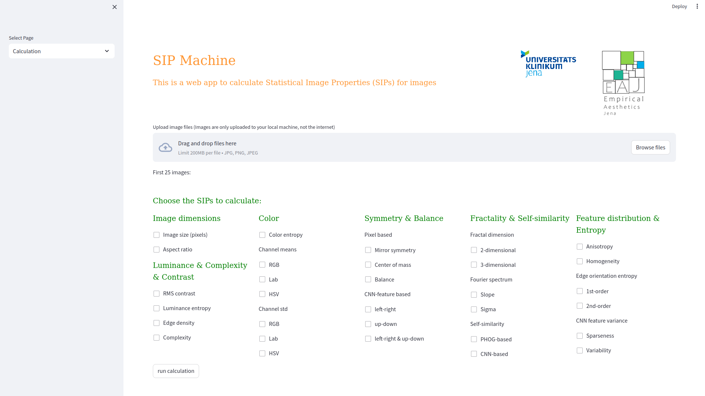

# SIP Machine

This project contains Python scripts to run a streamlit application in your browser. This application computes a number of commonly studied SIPs (statistical image properties) for aesthetic research.

# Installation instructions

[Installation Linux](https://github.com/RBartho/SIPmachine/edit/master/docs/InstallationInstructions_Linux.md)


1. Download all files from this GitHub repository to your computer. (Download under green "Code" Button.)

2. If you do not already have Anaconda or Miniconda installed, download and install Anaconda for your operating system (Windows, Mac, Linux):

	https://www.anaconda.com/download

3. Open a terminal on your system. If you do not know how to do this on your system, google it :-).

4. Navigate to the downloaded files in the terminal window. If you do not know how to change folders in terminal, google it :-). 

5. In the same folder where the file "requirements.txt" is, run this command in the terminal:

```shell
conda create --name SIP_machine -y
```

This should create a python enviroment with the name "SIPmachine" 


6. Activate the new environment by typing into the terminal:

```shell
conda activate SIP_machine
```

7. Install all needed python packages into the new python enviroment by:

```shell
conda install --file requirements.txt -y
```
	
9. Now launch the streamlit application from the terminal in the same folder as above:

```shell
python -m streamlit run SIP_machine.py
```

Your default browser should open the application on your local machine. It should look like this: 


# Starting the application (after installation)

1. Open a terminal on your system and navigate to the downloaded folder containing the SIP_machine.py file.

2. Activate the created Python environment by typing into the terminal
```shell
conda activate SIP_machine
```
3. Now start the streamlit application from the terminal in the same folder as above with

```shell
python -m streamlit run SIP_machine.py
 ```

# Notes on using the application

1. If you want to restart the app, just refresh your browser. All loaded data will be removed and all active calculations will stop.

2. Dont interact with the application (e.g. selecting SIPs, Sidebar, uploading or deleting images) while SIP-computations are running. It will refresh the application and all progress will be lost.

3. Multithreading is not supported. To calculate SIPs for very large datasets, you may want to consider running multiple instances of the application.

# Privacy and security
All calculations and data transfers take place on the local computer. The browser is only used as an interface. No data is uploaded to the Internet.
